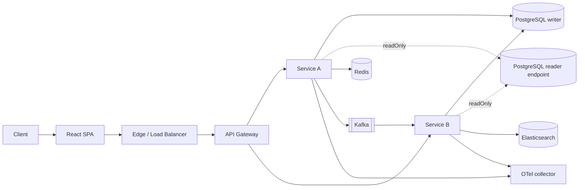
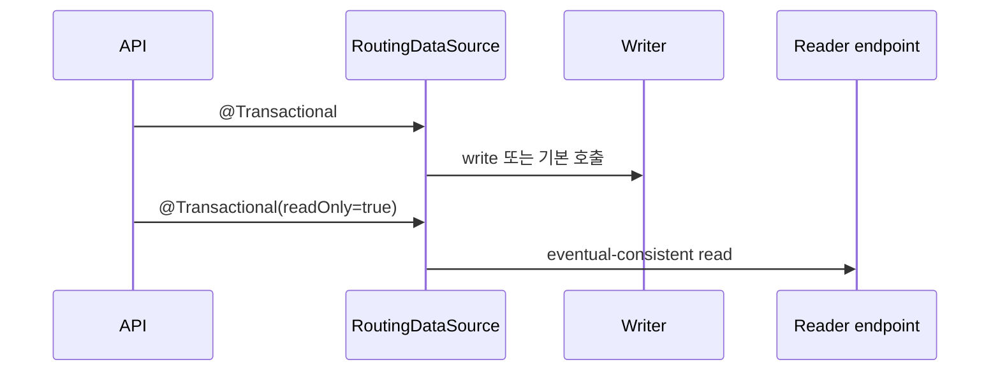

# 권장 아키텍처

위 그림은 개발자 구성 흐름과 런타임 요청·데이터 흐름을 함께 보여준다. 정확한 경계와 예외 규칙은 아래 다이어그램과 설명을 기준으로 한다.

## 1. 논리 구조

로컬 `apps/web`은 같은 origin의 `/api`를 호출하고 Vite proxy가 Gateway로 전달한다. dev/prod에서는 런타임 `app-config.json`과 ingress/LB가 같은 경계를 유지한다. 브라우저는 내부 sample-service 주소를 직접 알지 않는다. 자세한 결정은 [ADR 0002](adr/0002-frontend-runtime-boundary.md)를 따른다.

`auth.enabled=true`이면 SPA는 외부 OIDC provider와 Authorization Code + PKCE를 수행하고 access token을 Gateway 요청에만 붙인다. 인증이 꺼지면 OIDC module 자체를 불러오지 않는다. Gateway가 JWT를 검증하고, 공개 API 계약과 프론트 타입은 `contracts/openapi`에서 연결한다. 자세한 실행은 [OIDC 인증 가이드](authentication.md), 계약 변경은 [OpenAPI 가이드](api-contracts.md)를 따른다.

서비스는 다른 서비스의 DB를 읽지 않는다. 동기 호출은 명확한 API 계약으로, 비동기 통합은 Kafka 이벤트로 연결한다. Redis는 캐시와 짧은 수명의 조정 데이터에 사용하며 영속 이벤트 원장으로 간주하지 않는다.

## 2. 용량 등급은 실측으로 승격한다

아래 값은 보장 TPS가 아니라 최초 부하 시험을 위한 배치 시작점이다.

| 계획 등급 | 초기 애플리케이션 배치 | 데이터 계층 | 필수 검증 |
|---|---|---|---|
| C0 개발 | 서비스당 1개, 0.5~1 vCPU | 단일 PostgreSQL | 기능 스모크 |
| C1 소형 | 서비스당 2개, 각 1~2 vCPU | writer 1 + 백업 | 목표 TPS 2배 30분 |
| C2 중형 | 서비스당 3개 이상, 각 2~4 vCPU | writer + reader endpoint | 장애 1개 제거 후 목표 TPS 유지 |
| C3 고부하 | 서비스별 독립 autoscaling | 다중 AZ 관리형 DB, 파티션 설계 | 단계 상승·spike·soak·failover |

최종 등급은 다음 조건을 모두 만족한 결과에만 붙인다.

- 목표 TPS에서 p95와 p99가 서비스 SLO 이내다.
- 5xx와 timeout 비율이 error budget 이내다.
- CPU, 메모리, GC, DB pool, Kafka lag 중 하나도 지속 포화되지 않는다.
- 인스턴스 하나를 제거해도 허용된 복구 시간 안에 정상화된다.
- 테스트 데이터 크기가 운영 예상량을 반영한다.

## 3. PostgreSQL 읽기/쓰기 분리

starter는 안전한 기본값을 위해 다음 규칙을 사용한다.

- 명시되지 않은 트랜잭션은 writer로 간다.
- `readOnly=true`인 트랜잭션만 reader로 간다.
- reader URL이 없으면 모든 요청을 writer로 보낸다.
- 쓰기 직후 최신 값을 읽어야 하는 흐름은 같은 writer 트랜잭션에서 처리한다.
- 애플리케이션이 여러 replica를 직접 순회하지 않고 관리형 reader endpoint 또는 DB proxy에 위임한다.

복제 지연을 허용할 수 없는 잔액, 재고 확정, 권한 변경 직후 조회에는 reader를 사용하지 않는다.

### reader 장애는 자동으로 writer로 넘어가지 않는다

reader fallback은 **기동 시점**에만 일어난다. reader URL이 비어 있으면 reader pool이 writer를 가리키지만, 실행 중 reader 연결이 끊기면 `readOnly=true` 트랜잭션은 그대로 실패한다. 2026-08-28 로컬 실측에서 목표 TPS 8로 Gateway를 경유하는 동안 단일 reader 컨테이너를 약 15초 중단했을 때 오류율 27.9%가 나왔다([검증 기록](verification.md)).

따라서 R/W 분리는 다음 조건에서만 켠다.

- 관리형 reader endpoint나 DB proxy가 reader 장애를 앱 밖에서 흡수한다.
- 또는 reader 장애 동안 읽기 실패를 허용한다는 SLO 합의가 있다.

둘 다 아니라면 `platform.datasource.reader.url`을 비워 두고 writer 하나로 시작하는 것이 가용성이 더 높다. 실행 중 자동 fallback을 starter에 넣을지는 일관성과 장애 확산 위험을 비교한 ADR로만 결정한다([남은 작업](remaining-work.md) P1-C).

## 4. 기능별 경계

| 기능 | 애플리케이션 포트 | 기본 구현 | 대체 가능 구현 |
|---|---|---|---|
| 캐시 | `JsonCache` | Redis | Caffeine, managed Redis |
| 이벤트 발행 | `EventPublisher` | Kafka | outbox relay, cloud broker adapter |
| 검색 | `SearchGateway` | Elasticsearch | OpenSearch adapter |
| 인증 | 표준 JWT/OIDC | 외부 IdP, 로컬 Keycloak | Auth0, Entra ID, Cognito |
| 관측 | Micrometer/OTLP | OTel collector | 상용 APM exporter |

제품이 다른 기술을 쓰더라도 비즈니스 코드의 포트는 유지하고 adapter만 교체한다. 단, Kafka와 Redis Streams처럼 전달 보장이 다른 시스템을 같은 구현으로 취급하지 않는다.

## 5. 참조 구현이 따르는 성능 규칙

`services/sample-service`는 생성기가 복제하는 기준이므로 다음 규칙을 코드로 보여 준다.

- **목록 API는 항상 한 페이지만 반환한다.** `GET /api/v1/items`는 `page`/`size`를 받고 `size`는 1~200, 기본 50이다. 상한을 넘으면 400 Problem Detail을 돌려준다. 전체 행을 직렬화하는 `findAll()`은 두지 않는다. 2026-08-28 실측에서 무제한 `findAll()`이 10,002행에서 약 1.1MB를 매 요청 반환해 knee가 8 TPS로 나온 것이 이 규칙의 근거다.
- **정렬은 인덱스가 있는 열로 고정한다.** 목록은 `created_at` 내림차순이며, 행 수가 커지면 migration에서 인덱스를 함께 추가한다.
- **쿼리 파라미터 검증은 Bean Validation으로 한다.** `@Min`/`@Max` 위반은 web starter의 공통 handler가 `VALIDATION_FAILED` Problem Detail로 바꾸므로 controller에 분기를 넣지 않는다.

## 6. 알려진 경계 격차

아래는 설계 결함이 아니라 아직 계약이 없는 지점이다. 새 서비스를 붙일 때 직접 처리해야 한다.

| 격차 | 현재 상태 | 처리 방법 |
|---|---|---|
| Gateway route | `gateway-service`의 `application.yml`에 sample-service route 하나만 있다. 서비스 생성기는 route를 추가하지 않는다. | 새 서비스마다 route와 circuit breaker instance를 Gateway 설정에 직접 추가한다. 생성기·Gateway 사이 계약은 [남은 작업](remaining-work.md) P1-D다. |
| CSRF | security starter와 Gateway는 CSRF를 끈다. Bearer token만 받는 resource server에서는 안전한 기본값이다. | HTTP-only cookie 세션이나 BFF를 붙이면 이 기본값을 그대로 쓰면 안 된다. [ADR 0003](adr/0003-spa-oidc-public-client.md)의 BFF 조건과 함께 CSRF 방어를 다시 켠다. |
| 검색 포트 | `SearchGateway.query`는 자유 텍스트 하나만 받는다. 필터·정렬·집계는 표현하지 못한다. | 실제 검색 요구가 생기면 포트를 확장하고 계약 테스트를 함께 추가한다. 수요 없이 넓히지 않는다. |
| 운영 배포 | Helm, Secret 주입, migration job이 없다. dev/prod fail-fast 계약은 설정 해석 수준에서만 검증됐다. | [남은 작업](remaining-work.md) P1-B. |
